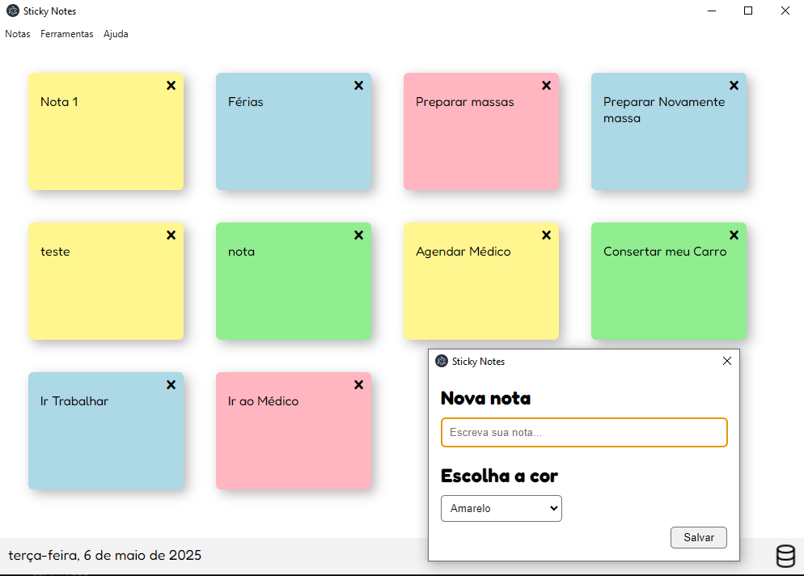

# StickyNotes
Projeto de notas autoadesivas (estilo post-it) usando o framewrok Electron e o banco de dados MongoDB.

## Autor
Caio lOPES

## Pré-requisitos de instalação:
- Windows 10 ou superior
- Ter o banco de dados MongoDB instalado

### Instalação do MongoDB:
Acesse o site oficial:
[MongoDB](https://www.mongodb.com/try/download/community)

Baixe o MongoDB Community Server e instale com a opção de "Install MongoDB as a Service" ativada.

Após instalar, ele inicia automaticamente.

### Instalação do StickyNotes
Em releases faça o download da última versão (.exe) disponibilizada e execute no computador.

